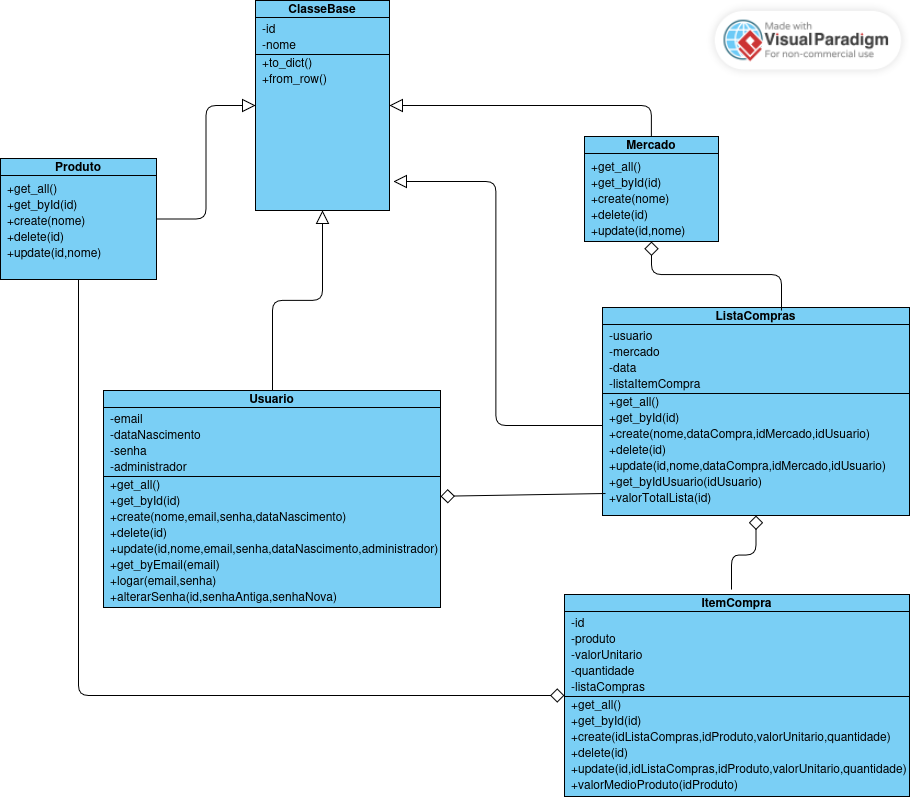

# Sistema Acadêmico - FCTE

## Descrição do Projeto

Desenvolvimento de um sistema de criação de lista de compras. 

Listas personalizadas por usuário contendo controle de mercados e produtos, valores médios de produtos e valor total de uma lista de compra.

Desenvolvido em Python e Bottle para ambiente web.

É dividido em dois projetos: Backend(API rest) e Frontend.

Utiliza além do Bottle, a biblioteca Beaker.Middleware para controle de variáveis de Sessão no Frontend.

O Backend implementa uma API Rest, armazenando os dados através do banco SQLite. As rotas estão definidas nos controllers e utilizam os 4 comandos básicos do padrão Rest: get, post, delete e put, sempre devolvendo dados em formato JSON.

Os atributos do diagrama de classes estão implementados em classes Python na pasta "models".

Os métodos do diagrama de classes estão implementados em classes Python na pasta "services".

O Frontend é responsável por responder com páginas HTML às rotas requisitadas no browser.

Praticamente toda a lógica de negócios está implementada no Backend.

Além do Bottle e do Middleware, a aplicação também utiliza outras bibliotecas internas do Python, tais como: json, os, datetime, SQLite3 entre outras.

O Frontend utiliza toda a formatação html através de CSS, sendo JavaScript utilizado apenas em um pequeno trecho da aplicação (para mostrar os valores médio dos produtos).

O enunciado do trabalho pode ser encontrado aqui:
- [Trabalho Final](https://github.com/lboaventura25/OO-T06_2025.1_UnB_FCTE/tree/main/trabalhos/epf)

## Dados do Aluno

- **Nome completo:** Tomás Garcia Rocho
- **Matrícula:** 242024988
- **Curso:** Engenharias
- **Turma:** FGA0158 -ORIENTAÇÃO A OBJETOS- T06

---

## Instruções para Compilação e Execução

1. **Compilação:**  
    * Após a instalação do interpretador Python, é necessário instalar a biblioteca Bottle e a biblioteca beaker.middleware.

    * pip install bottle

    * pip install beaker

2. **Execução:**  
    * Backend: ir para a pasta Backend e executar python app.py (ou python3 app.py) - por default roda na porta 8080
 
    * Frontend: ir para a pasta Frontend e executar python app.py (ou python3 app.py) - por default roda na porta 8081

    * Abrir o browser no endereço http://localhost/8081

    * Como dados de testes são criados, utilizar os usuarios usuarionormal@unb.br ou usuarioadministrador@unb.br, ambos com senha "segredo"

3. **Diagrama de Classes:**
    

## Contato

- [tomasgarciarocho@gmail.com]
